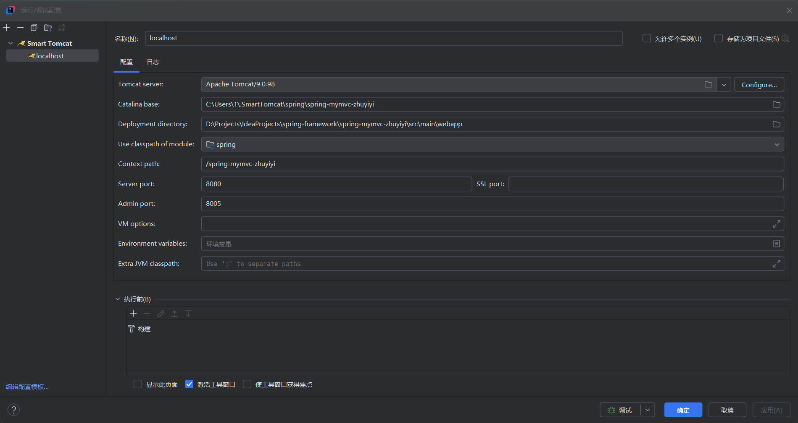

Tomcat配置  
Catalina base: C:\Users\{username}\.SmartTomcat\spring\spring-mymvc-zhuyiyi  
Deployment directory: D:\Projects\IdeaProjects\spring-framework\spring-mymvc-zhuyiyi\src\main\webapp  
Context path: /spring-mymvc-zhuyiyi  
